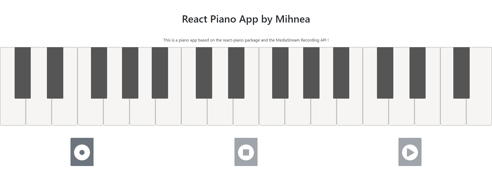

# A responsive piano app built with React.



One of my first react apps created with [Create React App](https://github.com/facebook/create-react-app).
Used react, bootstrap, css, react-soundfont-player, MediaStream Recording API.

## App Info

```bash

# Clone the repository
https://github.com/mihneavlad/react-scissors-rock-paper.git

# Install dependencies
yarn install

# Run it
yarn start

```

## Or see it live

[Responsive React Piano](https://mihneavlad.github.io/react-mihnea-piano/)

## Features

Play the piano, record notes played via microphone, stop recording, play recording.

### Author

Mihnea Vlad


